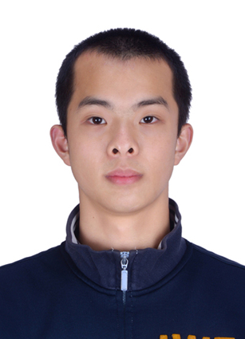

[中文](README.md) | [English](README_EN.md)

# 王苏祁 | Suqi Wang

南方科技大学机器人工程专业本科生，主要关注变胞机构、折纸机构、柔顺结构、机器人感知与仿生扑翼飞行器，重视从理论建模、结构设计和仿真分析到样机实验的完整研究过程。

## 目录

- [个人简介](#个人简介)
- [简历与联系方式](#简历与联系方式)
- [科研与项目经历](#科研与项目经历)  
- [论文与专利](#论文与专利)
- [其他经历](#其他经历)
  - [奖项](#奖项)
  - [学生活动](#学生活动)

## 个人简介

  

我于 2023 年 9 月进入南方科技大学机器人工程专业学习，辅修金融学，预计于 2027 年 6 月毕业，学术导师为戴建生院士。我的研究兴趣包括变胞与折纸机构、柔顺结构、机器人感知和仿生扑翼飞行器。我希望将机构设计、柔顺结构与机器人感知结合，并通过理论分析、仿真、样机和实验之间的相互验证，推进可感知、可重构机器人系统的研究。

- **GPA：** 3.88/4.00
- **加权平均分：** 92.81/100
- **专业排名：** 8/90
- **TOEFL：** 99
- **CET-6：** 579

## 简历与联系方式

- **学校与专业：** 南方科技大学，机器人工程（机械与能源工程系）
- **辅修专业：** 金融学（商学院）
- **学术导师：** 戴建生院士
- **研究兴趣：** 变胞与折纸机构、柔顺结构、机器人感知、仿生扑翼飞行器
- **机构设计与建模：** SolidWorks、AutoCAD
- **力学仿真与实验：** Abaqus、样机研制、力学测试、实验数据处理
- **编程与机器人开发：** Python、MATLAB、C++、Linux、ROS 2、Git
- **学校邮箱：** [12312116@mail.sustech.edu.cn](mailto:12312116@mail.sustech.edu.cn)
- **GitHub：** [wbaczt](https://github.com/wbaczt)
- **中文简历：** [TODO：补充移除手机号、出生年月和政治面貌后的公开版简历]
- **英文简历：** [TODO：补充英文简历]

## 科研与项目经历

| 项目 | 主要方向 | 本人角色 | 状态 |
|---|---|---|---|
| 驱感一体化刚柔耦合变胞夹爪（MAP Hand） | 变胞机构、柔顺结构、视触觉感知 | 项目负责人 | 进行中 |
| 可穿戴多 IMU 滑雪姿态监测与反馈系统 | 可穿戴传感、姿态分析、人机反馈 | 论文第二作者；参与系统与实验研究 | 论文已接收 |
| Flutterfly 仿生蝴蝶机器人 | 仿生扑翼、轻量化结构、系统集成 | 项目负责人 | 已完成 |
| “隧联飞检”地下管网巡检无人机 | 折叠防撞结构、快速原型、系统集成 | 结构设计与制造 | 竞赛项目 |

### 驱感一体化刚柔耦合变胞夹爪（MAP Hand）

**时间：** 2025 年 11 月至今  
**本人角色：** 项目负责人  
**项目状态：** 进行中

<!--
Recommended future assets:
Cover image: assets/projects/map-hand/cover.jpg
Demo GIF: assets/projects/map-hand/demo.gif
-->

#### 项目概述

项目面向具身智能中的自适应抓取与主动接触感知，设计由可变形可感知手掌与异构绳驱柔性手指组成的刚柔耦合夹爪，目标是研究掌指协同、自适应抓取和主动感知。

#### 本人贡献

- 完成 Sarrus 手掌机构的杆长综合、运动学映射与工作空间分析。
- 设计非对称预弯曲三交叉簧片柔顺指节，并使用 Abaqus 开展力学仿真。
- 参与力学测试、抓取实验与多轮样机迭代。
- 组织项目研究，推进掌指协同与主动接触感知方案验证。

#### 方法与工具

Sarrus 机构综合、运动学建模、工作空间分析、柔顺结构设计、Abaqus 有限元仿真、样机研制与力学测试。

#### 结果与成果

- 完成手掌与柔性手指样机迭代，并开展力学测试和抓取实验。
- 形成 2 项已受理的相关发明专利申请，其中 1 项本人为学生第一发明人。
- 相关论文仍在整理中，未公开论文内容与实验数据。

#### 展示材料

- [TODO：补充公开版项目封面图]
- [TODO：补充 5 至 10 秒功能演示 GIF]
- [TODO：补充脱敏后的系统结构图]

### 可穿戴多 IMU 滑雪姿态监测与反馈系统

**时间：** 2026 年 5 月至今  
**本人角色：** 论文第二作者；参与系统设计、实验设计、数据分析与论文修改  
**项目状态：** 论文已被 IEEE ICMA 2026 接收为口头报告

<!--
Recommended future assets:
Cover image: assets/projects/skiing-imu/cover.jpg
Demo GIF: assets/projects/skiing-imu/demo.gif
-->

#### 项目概述

项目面向滑雪训练中的实时姿态监测与反馈，构建由 5 个可穿戴 IMU 节点组成的采集系统，并提供桌面端与移动端可视化，目标是识别 A-frame、后座等典型姿态问题。

#### 本人贡献

- 参与可穿戴采集系统与验证实验的设计。
- 参与受控角度精度、静态姿态和室内滑雪实验。
- 参与数据分析，构建下肢角度离散度、前后姿态评分等可解释指标。
- 参与论文修改与结果整理。

#### 方法与工具

多节点 IMU 采集、角度精度实验、静态姿态实验、室内滑雪实验、姿态指标设计与实验数据分析。

#### 结果与成果

- 完成受控角度精度、静态姿态和室内滑雪实验。
- 相关论文被 IEEE ICMA 2026 接收为口头报告。
- [TODO：根据论文首页或录用材料确认正式作者顺序。]

#### 展示材料

- [TODO：补充公开版项目封面图]
- [TODO：补充 5 至 10 秒功能演示 GIF]
- [TODO：补充脱敏后的系统结构图]

### Flutterfly 仿生蝴蝶机器人

**时间：** 2025 年 10 月至 2026 年 5 月  
**本人角色：** 项目负责人  
**项目状态：** 已完成

<!--
Recommended future assets:
Cover image: assets/projects/flutterfly/cover.jpg
Demo GIF: assets/projects/flutterfly/takeoff.gif
-->

#### 项目概述

项目面向微型仿生飞行器的轻量化与机动需求，设计采用前翅主动驱动、后翅柔性随动的扑翼平台，目标是通过结构与系统协同实现稳定的轻量化起飞。

#### 本人贡献

- 负责扑翼结构设计、加工装配和飞行调试。
- 优化翅脉刚度梯度与翼膜变形特性。
- 参与主控板、接收机和执行器的选型集成、接口配置与系统联调。
- 完成 3 轮样机迭代和起飞测试。

#### 方法与工具

仿生扑翼结构设计、柔性随动设计、快速原型、加工装配、机电系统集成与飞行调试。

#### 结果与成果

- 完成 3 轮样机迭代，实现轻量化静态起飞。
- 获全国大学生机械创新设计大赛广东省一等奖、全国三等奖。

#### 展示材料

- [TODO：补充公开版项目封面图]
- [TODO：补充 5 至 10 秒起飞演示 GIF]
- [TODO：补充脱敏后的系统结构图]

### “隧联飞检”地下管网巡检无人机

**时间：** [TODO：确认项目起止时间]  
**本人角色：** 防撞框与模块化外壳的设计制造  
**项目状态：** 竞赛项目

<!--
Recommended future assets:
Cover image: assets/projects/pipeline-uav/cover.jpg
Demo GIF: assets/projects/pipeline-uav/demo.gif
-->

#### 项目概述

项目面向地下管网受限空间巡检，开发带有可折叠防撞结构和模块化外壳的无人机平台，重点验证受限空间中的结构防护、快速原型与系统集成方案。

#### 本人贡献

- 负责防撞框与模块化外壳的设计制造。
- 引入刚性折纸思路，实现防撞结构折叠收纳。
- 参与多轮样机迭代与实地验证。

#### 方法与工具

刚性折纸、结构设计、快速原型、模块化设计、样机迭代与实地验证。

#### 结果与成果

- 完成多轮样机迭代与实地验证。
- 获第五届“韶音杯”全球卓越创新人才夏校铂金奖第一名。
- 获南方科技大学第四届“梧桐树”校园创业之星大赛三等奖。

#### 展示材料

- [TODO：补充公开版项目封面图]
- [TODO：补充 5 至 10 秒功能演示 GIF]
- [TODO：补充脱敏后的系统结构图]

## 论文与专利

### 论文

- *A Wearable IMU System for Real-Time Skiing Posture Monitoring and Motion Feedback*. IEEE ICMA 2026，已接收为口头报告；本人为第二作者。[TODO：根据论文首页或录用材料补充完整作者顺序与规范引文。]

### 专利申请

1. **基于交叉簧片单元的柔顺手指机构及机械手**。发明专利申请，已受理；申请号：CN202610866553.8；本人学生发明人排序：1。
2. **具有掌内感知与掌指协同功能的机械抓手及控制方法**。发明专利申请，已受理；申请号：CN202610767293.9；本人学生发明人排序：4。
3. **变胞飞行器**。发明专利申请，已受理；申请号：CN202610205766.6；本人学生发明人排序：4。
4. **液压缸及液压缸位置自感知方法**。发明专利申请，已受理；申请号：CN202610650997.8；本人学生发明人排序：4。

## 其他经历

### 奖项

- **2026 年 5 月：** 第十二届全国大学生机械创新设计大赛广东省一等奖、全国三等奖。
- **2026 年 3 月：** 第十五届“挑战杯”中国大学生创业计划竞赛南方科技大学校内赛决赛优秀奖。
- **2025 年 12 月：** 南方科技大学第四届“梧桐树”校园创业之星大赛决赛三等奖。
- **2025 年 7 月：** 2025 年大学生工程实践与创新能力大赛工程创客赛项广东省一等奖。
- **2025 年 7 月：** 第五届“韶音杯”全球卓越创新人才夏校铂金奖（第一名）。
- **2023–2026 年：** 新生校长特别奖学金、优秀学生奖学金二等奖及其他荣誉表彰。

### 学生活动

- 担任南方科技大学创新智造社副社长。
- 参与组织并带队参加工程实践与创新能力大赛、机械创新设计大赛等赛事。
- 协调设备使用、项目准备、经验分享与团队沟通。
- 参与项目宣传和系内学生创新活动。
